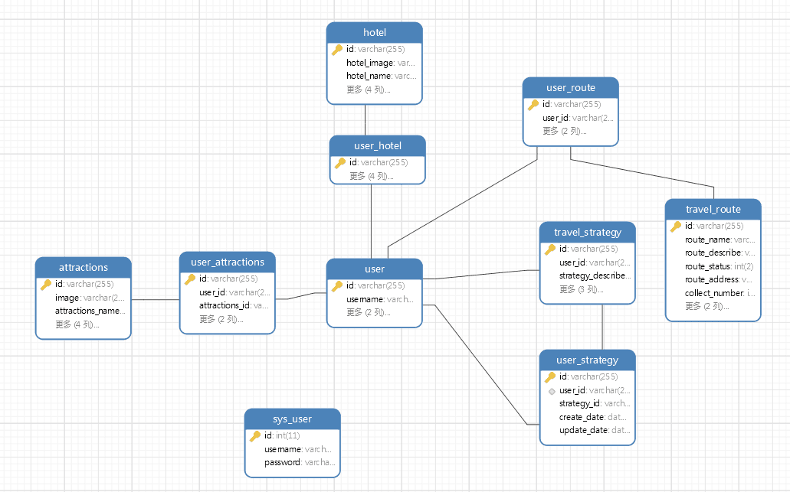

# travel

## IDDDS-page-front 包下为项目初始页面(创药网改编)

## 2019-5-25 搭建项目，技术栈使用SpringBoot+thymeleaf+JPA,后期会把我所有会的技术加入，包括项目转向为前后端分离

## 2019-5-26 项目完成情况（XYS）
1. 初始页面(大致样子)
2. 登录页面(大致样子)
3. 完成thymeleaf，layout布局分离

## 2019-5-27 项目完成情况（XYS）
1. 注册页面(大致样子)
2. 自适应修改其他页面

## 2019-5-28 项目完成情况（XYS）
1. 首页页面布局
2. 客栈页面布局

## 2019-5-29 项目完成情况（XYS）
1. 核心模块core编写，核心模块包括以下四个内容
    1. 返回类型 Result
    2. 返回类型响应错误码枚举 ResultCode
    3. 返回类型封装类 ResultGenerator
    4. 抛出异常类 ServiceException
2. 完成登录功能
3. 添加工具类，UUID生成
4. 数据库(user表设计)

## 2019-5-30 项目完成情况（CZ）
1. 完成登出功能
2. 完成注册功能

## 2019-6-1 项目完成情况
1. 增加个人中心页面(XYS)
2. 增加个人信息修改页面(XYS)
3. 增加修改密码页面(XYS)
1. 个人中心页面显示代码编写(CZ)
2. 个人信息修改页面代码逻辑编写(CZ)
3. 修改密码页面代码逻辑编写(CZ)

## 2019-6-2 项目完成情况
1. 旅游管理系统后台-前端页面设计(ZMY)
6. 明阳旅行简介 (ZMY)
7. 酒店数据（图片“xx酒店名称”-酒店名，酒店地址，酒店介绍-“xx酒店介绍-介绍介绍介绍介绍介绍介绍dgashjfhklshjahdjashjdajkdh”）(ZMY)
8. 景点介绍（图片“xx景点名称”-景点名，景点地址，景点介绍-“xx景点介绍-介绍介绍介绍介绍介绍介绍dgashjfhklshjahdjashjdajkdh”）(ZMY)
9. 数据库基本表-景点-酒店-设计(ZCJ)
10. 分页模块整合(XYS)

## 2019-6-3 项目完成情况
1. 旅游管理系统后台-酒店管理页面分页页面设计和代码编写(XYS)
1. 旅游管理系统后台-酒店管理页面,增加/修改模态框导入(XYS)

## 2019-6-4 项目完成情况
1. 旅游管理系统后台-酒店管理页面增加,启用/停用,修改(XYS)

## 2019-6-5 项目完成情况
1. 预订模块-酒店预订页面,分页显示,根据酒店名称查询功能(XYS)
2. 页面布局整理,导航栏整理(XYS)
4. 预订模块-酒店预订页面详情页面(XYS)
2. 旅游管理系统后台-登录功能(CZ)
3. 旅游管理系统后台-登出功能(CZ)
4. 旅游管理系统后台-用户列表分页显示(CZ)

## 2019-6-8 项目完成情况
1. 预订模块-我的预订页面,显示,取消预订(XYS)
1. 预订模块-酒店详情页面-预订功能(XYS)
5. 旅游管理系统后台-用户列表重置密码(CZ)
1. 旅游管理系统后台-旅游景点增/(停用.启用)/改/查/分页显示(CZ)

## 2019-6-9 项目完成情况
1. 数据库表设计(XYS)--数据库表基本设计完成

## 已分配,还未写完
1. index首页数据填充(CZ)
4. 预订模块-景点预订页面,分页显示,预订功能(CZ)
4. 预订模块-我的预定页面,景点显示,取消预订(CZ)

## 暂未写
1. 旅行路线模块-旅游路线列表显示/关注(CZ)
1. 旅游管理系统后台-旅游路线增/(停用.启用)/改/查/分页显示(CZ)

## 以后再写
1. 预订模块-右边热门栏模块编写(XYS)
2. 旅游管理系统后台-AOP后端管理系统身份验证(XYS)
2. AOP明阳旅游系统身份验证(XYS)

